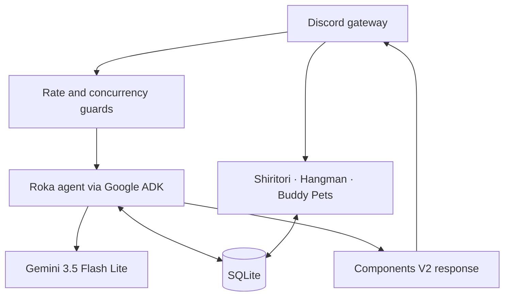

<a id="readme-top"></a>

<div align="center">
  

  <h1>Rokabot</h1>

  <p>
    A server-wide Discord character chatbot embodying <strong>Maniwa Roka</strong> from <em>Senren*Banka</em>.<br />
    In-character conversation, useful tools, and small games—self-hosted on a Raspberry Pi.
  </p>

  <p>
    
    
    
    
    
    
  </p>

  <p>
    <a href="#getting-started">Get started</a> ·
    <a href="docs/trd.md">Technical reference</a> ·
    <a href="docs/runbook.md">Operations runbook</a>
  </p>
</div>

<details>
  <summary><strong>Table of Contents</strong></summary>
  <ol>
    <li><a href="#who-is-maniwa-roka">Who is Maniwa Roka?</a></li>
    <li><a href="#what-it-does">What it does</a></li>
    <li><a href="#architecture">Architecture</a></li>
    <li><a href="#tech-stack">Tech stack</a></li>
    <li><a href="#getting-started">Getting started</a></li>
    <li><a href="#configuration">Configuration</a></li>
    <li><a href="#documentation">Documentation</a></li>
    <li><a href="#privacy">Privacy</a></li>
    <li><a href="#license">License</a></li>
  </ol>
</details>

## Who Is Maniwa Roka?


**Maniwa Roka** (馬庭 芦花) is a warm, gently teasing onee-san role side character from [Senren\*Banka](https://vndb.org/v19073) (千恋＊万花). Rokabot is a conversation-first multi-purpose bot that brings that energy to Discord and spreads love for side characters through in-character replies to **/slash commands**, **@mentions** and **replies**.


Rokabot will also respond with in-character dialogue powered by Gemini Flash Lite, perceives images, passively monitors conversations for context awareness, remembers personal facts about users across servers and maintains per-channel conversational memory.


<p align="right"><a href="#readme-top">↑</a></p>

## What It Does

- Responds in character to `/chat`, mentions, replies, and supported name-keyword triggers.
- Understands images, keeps channel context, and extracts user facts from monitored conversations.
- Provides dice, coin, time, weather, web search, anime, schedule, memory, and reminder tools.
- Includes Shiritori, Hangman, and Buddy Pets, with scores and companions stored in SQLite.
- Uses styled Discord Components V2 replies, rule-based tone detection, passive emoji reactions, and per-channel concurrency/rate-limit guards.

For the complete slash-command reference and feature details, see the [technical reference](docs/trd.md).

## Architecture



The bot runs as a single self-hosted Node.js service. SQLite persists conversation history, user memory, reminders, and game data; the full data model, request flow, and operational constraints live in [docs/trd.md](docs/trd.md).

## Tech Stack

| Area                 | Technology                                                  |
| -------------------- | ----------------------------------------------------------- |
| Language and runtime | TypeScript (ES2022), Node.js 24                             |
| Discord              | discord.js v14                                              |
| Agent and model      | Google ADK, Gemini 3.5 Flash Lite (`gemini-3.5-flash-lite`) |
| Storage              | SQLite via better-sqlite3                                   |
| Media and validation | sharp, Zod                                                  |
| Quality              | Vitest, Biome, Prettier, commitlint                         |
| Deployment           | Docker Compose on Raspberry Pi 5 (ARM64)                    |

## Getting Started

### Prerequisites

- Node.js 24.13.0 or newer
- A Discord bot token and client ID, with the Message Content privileged intent enabled
- A Gemini API key
- Docker and Docker Compose for containerized deployment
- Optional: a Tavily API key for web search

### Install and Configure

```bash
git clone https://github.com/AlaskanTuna/rokabot.git
cd rokabot
npm ci
cp .env.example .env
```

Set the required values in `.env`:

```env
DISCORD_TOKEN=your_discord_bot_token
DISCORD_CLIENT_ID=your_discord_client_id
GEMINI_API_KEY=your_gemini_api_key
TAVILY_API_KEY=your_tavily_api_key # optional
```

`config.yml` contains non-secret tunables. The default model is `gemini-3.5-flash-lite`; set `GEMINI_MODEL` to override it.

### Run

```bash
# Development
npm run dev

# Production
npm run build
npm start

# Docker
docker compose up -d
```

Useful checks: `npm run lint`, `npm run format:check`, and `npm test`.

## Configuration

Secrets belong in `.env`; tunables belong in `config.yml` and can be overridden with environment variables.

| Setting                              | Environment Override                     | Purpose                                              |
| ------------------------------------ | ---------------------------------------- | ---------------------------------------------------- |
| `gemini.model`                       | `GEMINI_MODEL`                           | Gemini model ID (`gemini-3.5-flash-lite` by default) |
| `gemini.timeout`                     | `GEMINI_TIMEOUT`                         | Model request timeout                                |
| `rateLimit.rpm` / `rateLimit.rpd`    | `RATE_LIMIT_RPM` / `RATE_LIMIT_RPD`      | Request limits                                       |
| `session.ttl` / `session.windowSize` | `SESSION_TTL_MS` / `SESSION_WINDOW_SIZE` | Conversation-memory behavior                         |
| `discord.maxMessageLength`           | `DISCORD_MAX_MESSAGE_LENGTH`             | Reply length cap                                     |
| `logging.level`                      | `LOG_LEVEL`                              | Log verbosity                                        |

See [config.yml](config.yml) and [docs/trd.md](docs/trd.md) for the full configuration contract.

## Documentation

- [Product requirements](docs/prd.md)
- [Technical reference](docs/trd.md)
- [Deployment and operations runbook](docs/runbook.md)

## Privacy

Rokabot is self-hosted. It stores conversation history, extracted user facts, reminders, and game data in local SQLite. Messages used for responses and fact extraction are sent to the Gemini API. Server operators should inform members when passive monitoring is enabled in channels where Roka has been mentioned.

## License

MIT. 2026.
