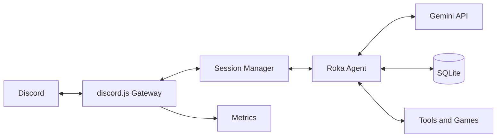
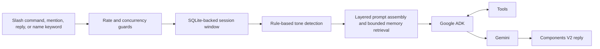
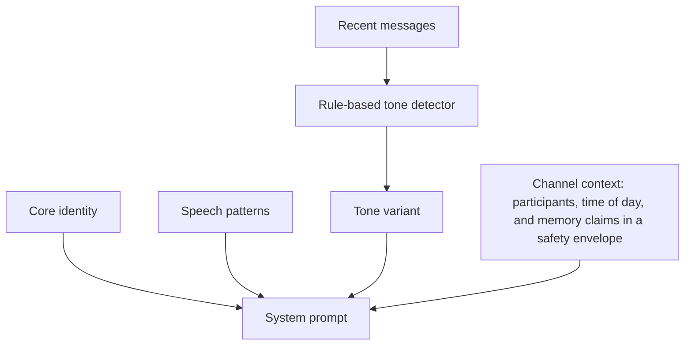
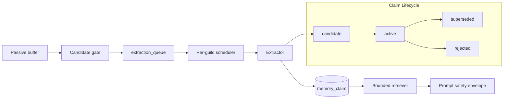
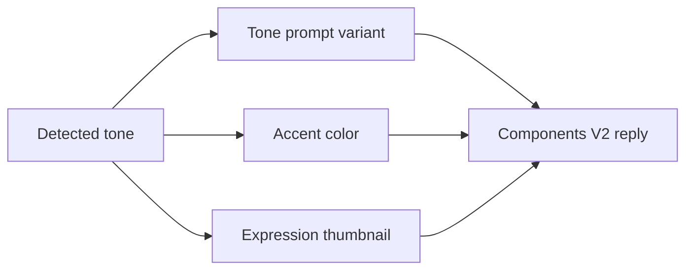
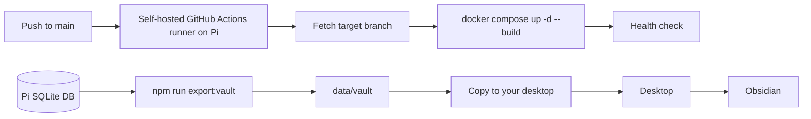

<a id="readme-top"></a>

<div align="center">
  

  <h1>Rokabot</h1>

  <p>
    A server-wide Discord character chatbot embodying <strong>Maniwa Roka</strong> from <em>Senren*Banka</em>.<br />
    In-character conversation, useful tools, and small games—self-hosted on a Raspberry Pi.
  </p>

  <p>
    
    
    
    
    
    
  </p>
</div>

<details>
  <summary><strong>Table of Contents</strong></summary>
  <ol>
    <li><a href="#who-is-maniwa-roka">Who Is Maniwa Roka?</a></li>
    <li><a href="#features">Features</a></li>
    <li><a href="#architecture">Architecture</a></li>
    <li><a href="#prompt-system">Prompt System</a></li>
    <li><a href="#memory">Memory</a></li>
    <li><a href="#expressions--tones">Expressions &amp; Tones</a></li>
    <li><a href="#tech-stack">Tech Stack</a></li>
    <li><a href="#getting-started">Getting Started</a></li>
    <li><a href="#configuration">Configuration</a></li>
    <li><a href="#deployment--operations">Deployment &amp; Operations</a></li>
    <li><a href="#documentation">Documentation</a></li>
    <li><a href="#privacy">Privacy</a></li>
    <li><a href="#license">License</a></li>
  </ol>
</details>

---

## Who is Maniwa Roka and Rokabot?


**Maniwa Roka** (馬庭 芦花) is a warm, gently teasing onee-san side character from [Senren\*Banka](https://vndb.org/v19073) (千恋＊万花). **Rokabot** brings her observant, affectionate energy to a Discord server through in-character conversation.


She can chat with a server, remember useful context within its own guild boundary, help with everyday requests, and make downtime more playful.


<p align="right"><a href="#readme-top">↑</a></p>

---

## Features

- **Conversation & Perception:** `/chat`, mentions, replies, and supported name-keyword triggers; image-aware conversations and recent channel context.
- **Memory:** Passive context monitoring and claims-based memory, isolated per guild and surfaced only through a bounded prompt envelope.
- **Tools:** In chat, Roka can roll dice, flip coins, check the time and weather, search the web, discover anime and airing schedules, and manage reminders; a cute footer notes the little ritual she performed.
- **Stats:** Fun server analytics with a mood ring, charts, and memory counts across 7D, 30D, and 90D views.
- **Games:** Buddy Pets, Hangman, and Shiritori, with SQLite-backed progress and leaderboards.
- **Interaction & UX:** Rule-based tone detection, expression thumbnails, Components V2 replies, emoji reactions, rate limits, and per-channel concurrency protection.

| Command or Capability  | Use                                                                                          |
| ---------------------- | -------------------------------------------------------------------------------------------- |
| `/chat`                | Talk with Roka; optionally attach an image.                                                  |
| `/gacha`               | Hatch, view, pet, inspect stats, browse collection, read the guide, or view the leaderboard. |
| `/hangman`             | Start and play a word-guessing game.                                                         |
| `/shiritori`           | Start, join, and score a word-chain game.                                                    |
| `/search`              | Search the web for current information.                                                      |
| `/anime`               | Search or browse anime, or search or browse airing schedules.                                |
| `/remind`              | Create, list, and cancel reminders.                                                          |
| `/stats`               | Explore overview, mood, memory, and nerd analytics with selectable windows and charts.       |
| In-Conversation Memory | Recall or save useful user facts within the current guild.                                   |

<p align="right"><a href="#readme-top">↑</a></p>

---

## System Architecture

### High-Level Overview

<details>
<summary>View Diagram</summary>



</details>

- One Node.js service handles Discord events, response generation, and local storage.
- SQLite is the durable store; the active session window is rehydrated for a live conversation.
- Tools and games remain available to the agent while its responses stay in character.

### Message Pipeline

<details>
<summary>View Diagram</summary>



</details>

- The concurrency guard permits one active response per channel.
- Tone detection examines recent conversation without an extra model call.
- Read the [technical reference](./trd.md) for request contracts, data models, and failure behavior.

### Prompt System

<details>
<summary>View Diagram</summary>



</details>

- The four layers are core identity, speech patterns, a tone variant, and channel context.
- The detector selects from 12 tones using recent messages; it adds no LLM cost.
- The assembled system prompt is budgeted at roughly 1,000–1,600 tokens. See the [technical reference](./trd.md) for the deeper contract.

### Memory

<details>
<summary>View Diagram</summary>



</details>

- Roka retains useful facts and relationships for the guild where they were observed; memory does not cross servers.
- Extraction is asynchronous, while retrieval remains bounded before a response is generated.
- The exported memory graph is browseable in Obsidian; see [Browsing Memory in Obsidian](#browsing-memory-in-obsidian).
- For schema, lifecycle, and retrieval details, see [Memory Architecture (Claims)](./trd.md#memory-architecture-claims).

### Expressions & Tones

<details>
<summary>View Diagram</summary>



</details>

Each detected tone selects a prompt variant, an accent color, and one of its mapped expression thumbnails before Roka's Components V2 reply is built.

| Tone        | Accent Color | Expression Pool                           |
| ----------- | ------------ | ----------------------------------------- |
| playful     | `#FFB3D9`    | smile, cheerful                           |
| sincere     | `#A8D8FF`    | sad, pained, sorrowful                    |
| domestic    | `#FFD4B5`    | content, gentle_smile, relieved           |
| flustered   | `#FFB3B3`    | flustered, nervous, awkward               |
| curious     | `#B2EBF2`    | thinking, surprised, blank_stare          |
| annoyed     | `#F8B4B8`    | exasperated, dissatisfied, dissatisfied_2 |
| tender      | `#E1BEE7`    | worried, troubled, anxious                |
| confident   | `#C8E6C9`    | composed, base, explaining                |
| nostalgic   | `#D4A574`    | melancholy, downcast, somber              |
| mischievous | `#FFD700`    | delighted, attentive                      |
| sleepy      | `#B0C4DE`    | serene, resigned                          |
| competitive | `#FF6B6B`    | frustrated, dissatisfied_3, uncertain     |

<p align="right"><a href="#readme-top">↑</a></p>

---

## Tech Stack

| Area                 | Technology                                                  |
| -------------------- | ----------------------------------------------------------- |
| Language and Runtime | TypeScript (ES2022), Node.js 24                             |
| Discord              | discord.js v14                                              |
| Agent and Model      | Google ADK, Gemini 3.5 Flash Lite (`gemini-3.5-flash-lite`) |
| Storage              | SQLite via better-sqlite3                                   |
| Media and Validation | sharp, Zod                                                  |
| Quality              | Vitest, Biome, Prettier, commitlint                         |
| Deployment           | Docker Compose on Raspberry Pi 5 (ARM64)                    |

<p align="right"><a href="#readme-top">↑</a></p>

---

## Getting Started

### Prerequisites

- Node.js 24.13.0 or newer.
- A Discord bot token and client ID, with the Message Content privileged intent enabled.
- A Gemini API key.
- Docker and Docker Compose for containerized deployment.
- Optional: a Tavily API key for web search.

### Install & Configure

```bash
git clone https://github.com/AlaskanTuna/rokabot.git
cd rokabot
npm ci
cp .env.example .env
```

### `.env` Secrets

| Variable            | Required | Purpose                                                |
| ------------------- | -------- | ------------------------------------------------------ |
| `DISCORD_TOKEN`     | Yes      | Discord bot token.                                     |
| `DISCORD_CLIENT_ID` | Yes      | Discord application client ID.                         |
| `GEMINI_API_KEY`    | Yes      | Gemini API key for response generation and extraction. |
| `TAVILY_API_KEY`    | No       | Tavily API key for web search.                         |

```env
DISCORD_TOKEN=your_discord_bot_token
DISCORD_CLIENT_ID=your_discord_client_id
GEMINI_API_KEY=your_gemini_api_key
TAVILY_API_KEY=your_tavily_api_key
```

Other optional environment values, including `GRAPHIFY_GEMINI_API_KEY` and `ROKABOT_DB_PATH`, are documented in [`.env.example`](../.env.example).

### Run

```bash
# Development
npm run dev

# Production
npm run build
npm start

# Docker
docker compose up -d
```

Quick checks: `npm run lint`, `npm run format:check`, and `npm test`.

<p align="right"><a href="#readme-top">↑</a></p>

---

## Configuration

Secrets belong in `.env`; tunables belong in [`config.yml`](../config.yml). Environment variables override the values listed below when the loader supports them.

### Gemini

<details>
<summary>View Tunables</summary>

| YAML Path                     | Env Override                    | Purpose                                                           |
| ----------------------------- | ------------------------------- | ----------------------------------------------------------------- |
| `gemini.model`                | `GEMINI_MODEL`                  | Live Gemini model ID.                                             |
| `gemini.extractionModel`      | `GEMINI_EXTRACTION_MODEL`       | Optional background extraction model; defaults to the live model. |
| `gemini.timeout`              | `GEMINI_TIMEOUT`                | Request timeout in milliseconds.                                  |
| `gemini.maxRetries`           | `GEMINI_MAX_RETRIES`            | Maximum retries for transient failures.                           |
| `gemini.maxOutputTokens`      | `GEMINI_MAX_OUTPUT_TOKENS`      | Response token safety cap.                                        |
| `gemini.baseRetryDelay`       | —                               | Initial retry delay in milliseconds.                              |
| `gemini.maxLlmCalls`          | —                               | Maximum chained tool calls per request.                           |
| `gemini.liveMaxRetries`       | `GEMINI_LIVE_MAX_RETRIES`       | Retry attempts after a failed live response.                      |
| `gemini.retryRpmFloor`        | `GEMINI_RETRY_RPM_FLOOR`        | Minimum remaining RPM required for a live retry.                  |
| `gemini.extractionRpmFloor`   | `GEMINI_EXTRACTION_RPM_FLOOR`   | Minimum remaining RPM required for background extraction.         |
| `gemini.extractionMaxRetries` | `GEMINI_EXTRACTION_MAX_RETRIES` | Retry attempts after a transient extraction failure.              |
| `gemini.retryBackoffBaseMs`   | `GEMINI_RETRY_BACKOFF_BASE_MS`  | Initial full-jitter retry backoff in milliseconds.                |
| `gemini.retryBackoffCapMs`    | `GEMINI_RETRY_BACKOFF_CAP_MS`   | Maximum full-jitter retry backoff in milliseconds.                |

</details>

### Rate Limit, Session, and Discord

<details>
<summary>View Tunables</summary>

| YAML Path                      | Env Override                 | Purpose                                           |
| ------------------------------ | ---------------------------- | ------------------------------------------------- |
| `rateLimit.rpm`                | `RATE_LIMIT_RPM`             | Requests per minute cap.                          |
| `rateLimit.rpd`                | `RATE_LIMIT_RPD`             | Requests per day cap.                             |
| `session.ttl`                  | `SESSION_TTL_MS`             | Idle session lifetime in milliseconds.            |
| `session.windowSize`           | `SESSION_WINDOW_SIZE`        | Maximum messages rehydrated into the ADK session. |
| `session.maxRehydrationAge`    | —                            | Maximum age of a message rehydrated from SQLite.  |
| `session.historyRetentionDays` | —                            | Days before session history is pruned.            |
| `discord.maxMessageLength`     | `DISCORD_MAX_MESSAGE_LENGTH` | Character cap for a bot reply.                    |

</details>

### Memory

<details>
<summary>View Tunables</summary>

| YAML Path                           | Env Override                            | Purpose                                                    |
| ----------------------------------- | --------------------------------------- | ---------------------------------------------------------- |
| `memory.bufferSize`                 | `MEMORY_BUFFER_SIZE`                    | Passive in-memory buffer size per channel.                 |
| `memory.contextSize`                | —                                       | Overheard messages injected into one prompt.               |
| `memory.extractionInterval`         | `MEMORY_EXTRACTION_INTERVAL`            | Messages between background fact extraction attempts.      |
| `memory.extractionGapMs`            | `MEMORY_EXTRACTION_GAP_MS`              | Minimum time between extractions.                          |
| `memory.maxFactsPerUser`            | —                                       | Legacy stored-fact cap per user.                           |
| `memory.factRetentionDays`          | —                                       | Legacy unused-fact retention period.                       |
| `memory.channelMonitorTtlMs`        | —                                       | Monitoring lifetime after the latest mention.              |
| `memory.claimsBackend`              | `MEMORY_CLAIMS_BACKEND`                 | Enables typed claims extraction and retrieval.             |
| `memory.maxClaimsPerTurn`           | `MEMORY_MAX_CLAIMS_PER_TURN`            | Maximum claims included in one response.                   |
| `memory.retrievalTokenBudget`       | `MEMORY_RETRIEVAL_TOKEN_BUDGET`         | Approximate claims-envelope token budget.                  |
| `memory.recentParticipantLimit`     | `MEMORY_RECENT_PARTICIPANT_LIMIT`       | Non-speaker participants considered for retrieval.         |
| `memory.speakerMinShare`            | `MEMORY_SPEAKER_MIN_SHARE`              | Minimum share of selected claims reserved for the speaker. |
| `memory.maxActiveClaimsPerUser`     | `MEMORY_MAX_ACTIVE_CLAIMS_PER_USER`     | Active claim cap per user; pinned claims are exempt.       |
| `memory.claimRetentionDays`         | `MEMORY_CLAIM_RETENTION_DAYS`           | Retention period for inactive, unpinned claims.            |
| `memory.extractionDailyBudgetRatio` | `MEMORY_EXTRACTION_DAILY_BUDGET_RATIO`  | Gemini daily budget share reserved for extraction.         |
| `memory.perGuildGapMs`              | `MEMORY_PER_GUILD_GAP_MS`               | Minimum time between extraction batches for one guild.     |
| `memory.extractionQueueMaxPerGuild` | `MEMORY_EXTRACTION_QUEUE_MAX_PER_GUILD` | Maximum queued extraction payloads for one guild.          |
| `memory.vaultExportDir`             | `MEMORY_VAULT_EXPORT_DIR`               | Output directory for read-only Obsidian vault exports.     |

</details>

### Metrics, Emoji, Reminders, Games, and Runtime

<details>
<summary>View Tunables</summary>

| YAML Path                    | Env Override             | Purpose                                       |
| ---------------------------- | ------------------------ | --------------------------------------------- |
| `metrics.retentionDays`      | `METRICS_RETENTION_DAYS` | Days before metrics events are pruned.        |
| `emoji.probability`          | —                        | Chance of a keyword-matched emoji reaction.   |
| `emoji.cooldownMs`           | —                        | Per-channel cooldown between emoji reactions. |
| `reminders.checkIntervalMs`  | —                        | Reminder scheduler polling interval.          |
| `reminders.maxPerUser`       | —                        | Maximum active reminders per user.            |
| `reminders.staleThresholdMs` | —                        | Lateness threshold for dropping a reminder.   |
| `games.hangmanLives`         | —                        | Wrong guesses allowed in Hangman.             |
| `games.hangmanTimeoutMs`     | —                        | Hangman inactivity timeout.                   |
| `games.shiritoriTimeoutMs`   | —                        | Shiritori turn inactivity timeout.            |
| `games.shinyChance`          | —                        | Probability of hatching a shiny Buddy Pet.    |
| `statusCycleMs`              | —                        | Discord status rotation interval.             |
| `timezone`                   | `TZ`                     | IANA timezone for time-of-day features.       |
| `logging.level`              | `LOG_LEVEL`              | Pino log verbosity.                           |

</details>

For defaults and the full behavior behind these settings, see [`config.yml`](../config.yml) and the [technical reference](./trd.md).

<p align="right"><a href="#readme-top">↑</a></p>

---

## Deployment & Operations



- Docker Compose runs Rokabot on a Raspberry Pi 5 with `mem_limit: 512m` and `restart: unless-stopped`.
- The self-hosted GitHub Actions runner builds and health-checks code changes pushed to `main`; markdown and `docs/**` changes are ignored by that workflow.
- Use the [operations runbook](./runbook.md) for Pi commands, runner setup, troubleshooting, and database operations.

### Browsing Memory in Obsidian

1. On the Pi, run the export against the live SQLite database.
2. The default destination is `data/vault/`; set `MEMORY_VAULT_EXPORT_DIR` to write a different destination.
3. Treat the result as a read-only static snapshot. Re-run the export whenever you want it refreshed.
4. Copy it to a desktop machine, then open the copied folder as an Obsidian vault to browse the per-guild memory graph.

```bash
cd /path/to/rokabot
npm run export:vault
rsync -av data/vault/ desktop-user@desktop-host:~/Rokabot-vault/
```

Obsidian belongs on the desktop, not the Pi: it is a graphical desktop application, while the Pi is kept focused on the bot as a headless server.

<p align="right"><a href="#readme-top">↑</a></p>

---

## Documentation

- [Product Requirements](./prd.md)
- [Technical Reference](./trd.md)
- [Deployment and Operations Runbook](./runbook.md)

<p align="right"><a href="#readme-top">↑</a></p>

---

## Privacy

Rokabot is self-hosted and stores session history, memory claims, reminders, game data, and metrics in local SQLite. Claims are isolated per guild. Messages used to generate responses and extract memory are sent to the Gemini API. Server operators should disclose passive monitoring in channels where Roka has been mentioned.

<p align="right"><a href="#readme-top">↑</a></p>

---

## License

MIT. 2026.

<p align="right"><a href="#readme-top">↑</a></p>
